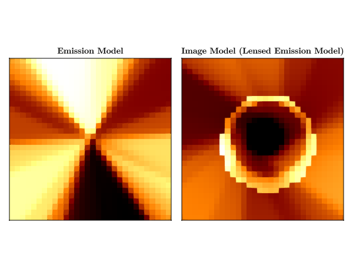
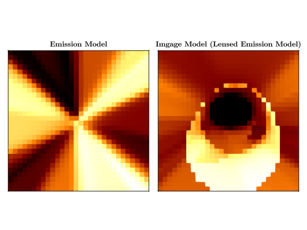
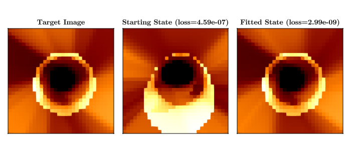

# Neural Network Emission Model Example {#Neural-Network-Emission-Model-Example}

This is a pedagogical example that serves as a proof of concept. We will build a simple General Relativistic Neural Radiance Field (NeRF) model to be ray traced and optimize with the ADAM algorithm.

##Setup We will first import the necessary packages and set the random seed. Our emission model will be a neural network built with Lux.jl

```julia
using Lux
using Krang
using Random
using Accessors
Random.seed!(123)
rng = Random.GLOBAL_RNG
```


```
Random._GLOBAL_RNG()
```


Our model will take in spacetime coordinates and return observed intensity value for a given pixel: We will use 0.99 spin Kerr metric with an observer sitting at 20 degrees inclination with respect to the spin axis in this example. These parameters are fixed for this example, but could be made to vary in the optimization process.

Lets define an `KerrNeRF` which will be comprised of an emission layer that we will raytrace. We will do this by first creating a struct to represent our image model that will store our emission model as a layer.

```julia
struct KerrNeRF{T<:Chain}
    emission_layer::T
end
```


The models in Lux are functors that take in features, parameters and model state, and return the output and model state. Lets define the function associated with our `KerrNeRF` type. We will assume that the emission is coming from emission that originates in the equatorial plane.

```julia
function (m::KerrNeRF)(x, ps, st)
    metric = Krang.Kerr(ps.spin)
    θo = ps.θo * π
    pixels = Krang.SlowLightIntensityPixel.(Ref(metric), x[1, :], x[2, :], θo)

    sze = unsafe_trunc(Int, sqrt(size(x)[2]))
    coords = zeros(Float64, 2, sze * sze)
    redshifts = zeros(Float64, 1, sze * sze)
    emission_vals = zeros(Float64, 1, sze * sze)
    for n = 0:1
        for i = 1:sze
            for j = 1:sze
                pix = pixels[i+(j-1)*sze]
                α, β = Krang.screen_coordinate(pix)
                ηtemp = η(metric, α, β, θo)
                λtemp = λ(metric, α, θo)
                rs, ϕs, νr, νθ, _ =
                    Krang.emission_coordinates_fast_light(pix, Float64(π / 2), β > 0, n)

                T = typeof(α)
                if rs ≤ Krang.horizon(metric)
                    coords[1, i+(j-1)*sze] = zero(T)
                    coords[2, i+(j-1)*sze] = zero(T)
                    redshifts[(i-1)*sze+j] = zero(T)
                else
                    ϕks = Krang.ϕ_kerr_schild(metric, rs, ϕs)
                    xs = rs * cos(ϕks)
                    ys = rs * sin(ϕks)

                    curr_p_bl_d = p_bl_d(metric, rs, π / 2, ηtemp, λtemp, νr, νθ)
                    curr_p_bl_u = metric_uu(metric, rs, π / 2) * curr_p_bl_d
                    p_zamo_u = jac_zamo_u_bl_d(metric, rs, π / 2) * curr_p_bl_u
                    coords[1, (i-1)*sze+j] = xs
                    coords[2, (i-1)*sze+j] = ys
                    redshifts[(i-1)*sze+j] = inv(p_zamo_u[1])
                end

            end
        end
        emission_vals .+= m.emission_layer(coords, ps, st)[1] .* redshifts
    end
    emission_vals, st
end
```


Lets define an emisison layer for our model as a simple fully connected neural network with 2 hidden layers. The emission layer will take in 2D coordinates on an equatorial disk in the bulk spacetime and return a scalar intensity value.

```julia
emission_model = Chain(
    Dense(2 => 20, Lux.tanh_fast),
    Dense(20 => 20, Lux.tanh_fast),
    Dense(20 => 1, Lux.sigmoid),
)

ps, st = Lux.setup(rng, emission_model); # Get the emission model parameters and state
ps = @insert ps.spin = 0.94 # Set the spin of the black hole
ps = @insert ps.θo = 20.0 / 180 # Set the inclination angle of the observer
```


```
(layer_1 = (weight = Float32[-1.9930933 0.13480707; 1.6587111 0.7846885; … ; 0.5545148 -0.21311225; -1.529758 -1.2062522], bias = Float32[0.028957667, 0.6422782, 0.06368262, 0.48916948, 0.5008789, 0.12268113, -0.52489245, -0.5348378, 0.59465873, -0.512276, -0.24440552, -0.6352531, -0.25062555, -0.16059795, 0.7026039, 0.4899658, -0.5401195, 0.05923529, 0.03167074, 0.3905907]), layer_2 = (weight = Float32[0.2090636 0.07168501 … 0.61720604 0.16018204; 0.092719935 -0.47666737 … -0.57773215 -0.29552248; … ; -0.21483387 0.40296352 … -0.6213537 0.090786815; -0.12311636 0.36841875 … 0.073762484 -0.36025298], bias = Float32[0.084122844, -0.115433946, -0.00920949, -0.019335521, 0.10757738, 0.018696364, -0.21156001, -0.089099385, -0.19688101, 0.09211258, -0.1802641, 0.19444387, 0.12264983, -0.21097833, -0.17754783, -0.112839594, 0.04218873, -0.14413916, -0.09799668, -0.13228038]), layer_3 = (weight = Float32[-0.27047503 0.20987642 … -0.06709826 -0.17421192], bias = Float32[0.20820317]), spin = 0.94, θo = 0.1111111111111111)
```


We can now create an image model with our emission layer.

```julia
image_model = KerrNeRF(emission_model)

# Plotting the model
```


```
Main.var"Main".KerrNeRF{Lux.Chain{@NamedTuple{layer_1::Lux.Dense{typeof(NNlib.tanh_fast), Int64, Int64, Nothing, Nothing, Static.True}, layer_2::Lux.Dense{typeof(NNlib.tanh_fast), Int64, Int64, Nothing, Nothing, Static.True}, layer_3::Lux.Dense{typeof(NNlib.σ), Int64, Int64, Nothing, Nothing, Static.True}}, Nothing}}(Lux.Chain{@NamedTuple{layer_1::Lux.Dense{typeof(NNlib.tanh_fast), Int64, Int64, Nothing, Nothing, Static.True}, layer_2::Lux.Dense{typeof(NNlib.tanh_fast), Int64, Int64, Nothing, Nothing, Static.True}, layer_3::Lux.Dense{typeof(NNlib.σ), Int64, Int64, Nothing, Nothing, Static.True}}, Nothing}((layer_1 = Dense(2 => 20, tanh_fast), layer_2 = Dense(20 => 20, tanh_fast), layer_3 = Dense(20 => 1, σ)), nothing))
```


Lets create an 20x20 pixel image of the `image_model` with a field of view of $10 MG/c^2$.

```julia
sze = 30
ρmax = 10e0
pixels = zeros(Float64, 2, sze * sze)
for (iiter, i) in enumerate(range(-ρmax, ρmax, sze))
    for (jiter, j) in enumerate(range(-ρmax, ρmax, sze))
        pixels[2, iiter+(jiter-1)*sze] = Float64(i)
        pixels[1, iiter+(jiter-1)*sze] = Float64(j)
    end
end
```


We can see the effects of raytracing on emission in the bulk spacetime by plotting an image of the emission model and the image model.

```julia
using CairoMakie
curr_theme = Theme(
    Axis = (
        xticksvisible = false,
        xticklabelsvisible = false,
        yticksvisible = false,
        yticklabelsvisible = false,
    ),
    Heatmap = (colormap = :afmhot,),
)
set_theme!(merge(curr_theme, theme_latexfonts()))

emitted_intensity = reshape(emission_model(pixels, ps, st)[1], sze, sze)
received_intensity = reshape(image_model(pixels, ps, st)[1], sze, sze)

fig = Figure();
heatmap!(Axis(fig[1, 1], aspect = 1, title = "Emission Model"), emitted_intensity)
heatmap!(
    Axis(fig[1, 2], aspect = 1, title = "Image Model (Lensed Emission Model)"),
    received_intensity,
)
CairoMakie.save("emission_model_and_target_model.png", fig)
```


```
┌ Warning: Mixed-Precision `matmul_cpu_fallback!` detected and Octavian.jl cannot be used for this set of inputs (C [Matrix{Float64}]: A [Matrix{Float32}] x B [Matrix{Float64}]). Converting to common type to to attempt to use BLAS. This may be slow.
└ @ LuxLib.Impl ~/.julia/packages/LuxLib/Kj0os/src/impl/matmul.jl:194
┌ Warning: Mixed-Precision `matmul_cpu_fallback!` detected and Octavian.jl cannot be used for this set of inputs (C [Matrix{Float64}]: A [Matrix{Float32}] x B [Matrix{Float64}]). Converting to common type to to attempt to use BLAS. This may be slow.
└ @ LuxLib.Impl ~/.julia/packages/LuxLib/Kj0os/src/impl/matmul.jl:194
```





## Fitting the NeRF model {#Fitting-the-NeRF-model}

This will be a toy example showing the mechanics of fitting our KerrNeRF to a target image using the normalized cross correlation as a kernel for our loss function. This will be the image we will try to fit our model to.

```julia
target_img = reshape(received_intensity, 1, sze * sze);
```


Lets fit our model using the normalized cross correlation as a kernel for our loss function.

```julia
using Enzyme
using Optimization
using OptimizationOptimisers
using StatsBase
using ComponentArrays

function mse(img1::Matrix{T}, img2::Matrix{T}) where {T}
    mean(((img1 ./ sum(img1)) .- (img2 ./ sum(img2))) .^ 2)
end

function loss_function(pixels, y, ps, st)
    y_pred, st = image_model(pixels, ps, st)
    mse(y, y_pred), st
end

mse(target_img, target_img)

ps, st = Lux.setup(rng, emission_model);
ps = @insert ps.spin = 0.5
ps = @insert ps.θo = 60.0 / 180
image_model = KerrNeRF(emission_model);

emitted_intensity = reshape(emission_model(pixels, ps, st)[1], sze, sze)
received_intensity = reshape(image_model(pixels, ps, st)[1], sze, sze)
loss_function(pixels, target_img, ps, st)

fig = Figure();
heatmap!(
    Axis(fig[1, 1], aspect = 1, title = "Emission Model"),
    emitted_intensity,
    colormap = :afmhot,
)
heatmap!(
    Axis(fig[1, 2], aspect = 1, title = "Imgage Model (Lensed Emission Model)"),
    received_intensity,
    colormap = :afmhot,
)
CairoMakie.save("emission_model_and_image_model.png", fig)
```


```
WARNING: using ComponentArrays.Axis in module Main conflicts with an existing identifier.
┌ Warning: Mixed-Precision `matmul_cpu_fallback!` detected and Octavian.jl cannot be used for this set of inputs (C [Matrix{Float64}]: A [Matrix{Float32}] x B [Matrix{Float64}]). Converting to common type to to attempt to use BLAS. This may be slow.
└ @ LuxLib.Impl ~/.julia/packages/LuxLib/Kj0os/src/impl/matmul.jl:194
┌ Warning: Mixed-Precision `matmul_cpu_fallback!` detected and Octavian.jl cannot be used for this set of inputs (C [Matrix{Float64}]: A [Matrix{Float32}] x B [Matrix{Float64}]). Converting to common type to to attempt to use BLAS. This may be slow.
└ @ LuxLib.Impl ~/.julia/packages/LuxLib/Kj0os/src/impl/matmul.jl:194
┌ Warning: Mixed-Precision `matmul_cpu_fallback!` detected and Octavian.jl cannot be used for this set of inputs (C [Matrix{Float64}]: A [Matrix{Float32}] x B [Matrix{Float64}]). Converting to common type to to attempt to use BLAS. This may be slow.
└ @ LuxLib.Impl ~/.julia/packages/LuxLib/Kj0os/src/impl/matmul.jl:194
```





Lets define callback function to print the loss as we optimize our model.

```julia
mutable struct Callback
    counter::Int
    stride::Int
    const f::Function
end
Callback(stride, f) = Callback(0, stride, f)
function (c::Callback)(state, loss, others...)
    c.counter += 1
    if c.counter % c.stride == 0
        @info "On step $(c.counter) loss = $(loss)"
        return false
    else
        return false
    end
end
```


We can now optimize our model using the ADAM optimizer.

```julia
ps_trained, st_trained = let st = Ref(st), x = pixels, y = reshape(target_img, 1, sze * sze)

    optprob = Optimization.OptimizationProblem(
        Optimization.OptimizationFunction(
            function (ps, constants)
                loss, st[] = loss_function(x, y, ps, st[])
                loss
            end,
            Optimization.AutoEnzyme(),
        ),
        ComponentArrays.ComponentVector{Float64}(ps),
    )

    solution = Optimization.solve(
        optprob,
        OptimizationOptimisers.Adam(),
        maxiters = 25_000,
        callback = Callback(100, () -> nothing),
    )

    solution.u, st[]
end
```


```
((layer_1 = (weight = [1.329005007335165 0.8838021455699725; 0.527605806178257 0.6917051922681818; … ; -1.825044973915624 1.4743138226946404; 0.8093182825021916 -1.7802958468425494], bias = [0.5316780451323629, -0.37267967698596677, 0.45088269138873244, -0.6258476933876792, 0.06361568022559443, -0.41016274500338007, 0.5052383072088681, 0.2576584724841851, -0.2720400228247643, -0.4251299433587754, 0.20674661393638413, 0.28115907779960625, -0.34435651290468006, 0.1695934875890986, -0.7920840579474977, 0.4098829547571094, 0.4323710728261112, -0.27691493320975447, 0.5004872853066582, -0.4541808695034249]), layer_2 = (weight = [-0.12409402139733568 -0.6290292794271019 … -0.2751305558289715 0.28814550785486903; -0.4598441328984639 -0.5074738343991347 … -0.04083808727731008 -0.48626916777483425; … ; 0.30680121708814295 0.026531435305984053 … 0.25352407864731763 0.17955904334855313; 0.25302508227373627 -0.17542119723328747 … -0.5506025695308104 -0.05884840786402416], bias = [-0.08762127082433276, -0.009753187150239774, 0.23563907689138183, -0.18266456979014029, 0.10374214543140992, -0.12884091894441219, 0.004892911938814829, 0.1795191366293615, 0.15022564590845516, 0.25278764336956955, -0.02280271845715201, 0.13079595283282242, 0.21354343104298712, 0.09472453464730393, 0.4056442443776332, -0.10006486424907729, -0.056988116134481195, -0.5287872280532959, 0.09697543453029249, -0.0008830054635169743]), layer_3 = (weight = [0.21212666868332306 -0.5097755440370377 … -0.055049655153902144 0.3742142362466608], bias = [-0.28982081465742776]), spin = 0.8908645569546856, θo = 0.11803524422007712), (layer_1 = NamedTuple(), layer_2 = NamedTuple(), layer_3 = NamedTuple()))
```


Let&#39;s plot the results of our optimization. and compare it to the target image.

```julia
received_intensity, st =
    ((x) -> (reshape(x[1], sze, sze), x[2]))(image_model(pixels, ps_trained, st_trained))
acc_intensity, st = ((x) -> (reshape(x[1], sze, sze), x[2]))(image_model(pixels, ps, st))
loss_function(pixels, target_img, ps, st)
loss_function(pixels, target_img, ps_trained, st_trained)

using Printf

fig = Figure(size = (700, 300))
heatmap!(Axis(fig[1, 1], aspect = 1, title = "Target Image"), reshape(target_img, sze, sze))
heatmap!(
    Axis(
        fig[1, 2],
        aspect = 1,
        title = "Starting State (loss=$(@sprintf("%0.2e", loss_function(pixels, target_img, ps, st)[1])))",
    ),
    acc_intensity,
)
heatmap!(
    Axis(
        fig[1, 3],
        aspect = 1,
        title = "Fitted State (loss=$(@sprintf("%0.2e", loss_function(pixels, target_img, ps_trained, st_trained)[1])))",
    ),
    received_intensity,
)
fig

save("neural_net_results.png", fig)
```


```
┌ Warning: Mixed-Precision `matmul_cpu_fallback!` detected and Octavian.jl cannot be used for this set of inputs (C [Matrix{Float64}]: A [Matrix{Float32}] x B [Matrix{Float64}]). Converting to common type to to attempt to use BLAS. This may be slow.
└ @ LuxLib.Impl ~/.julia/packages/LuxLib/Kj0os/src/impl/matmul.jl:194
┌ Warning: Mixed-Precision `matmul_cpu_fallback!` detected and Octavian.jl cannot be used for this set of inputs (C [Matrix{Float64}]: A [Matrix{Float32}] x B [Matrix{Float64}]). Converting to common type to to attempt to use BLAS. This may be slow.
└ @ LuxLib.Impl ~/.julia/packages/LuxLib/Kj0os/src/impl/matmul.jl:194
┌ Warning: Mixed-Precision `matmul_cpu_fallback!` detected and Octavian.jl cannot be used for this set of inputs (C [Matrix{Float64}]: A [Matrix{Float32}] x B [Matrix{Float64}]). Converting to common type to to attempt to use BLAS. This may be slow.
└ @ LuxLib.Impl ~/.julia/packages/LuxLib/Kj0os/src/impl/matmul.jl:194
```





---


_This page was generated using [Literate.jl](https://github.com/fredrikekre/Literate.jl)._
