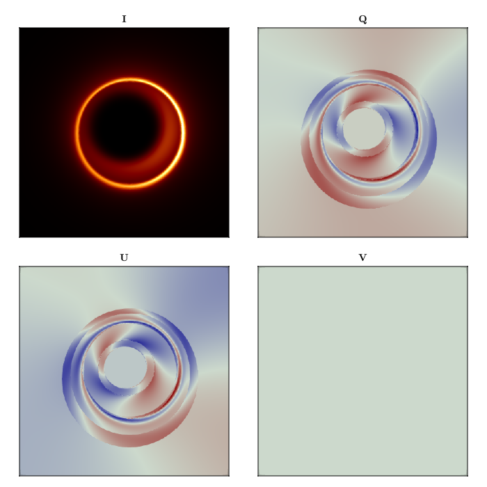

# Creating a Custom Dual Cone Model {#Creating-a-Custom-Dual-Cone-Model}

We will define a custom model for low luminosity active galactic nuclei (LLAGN). A detailed description of the model can be found in this [reference](https://doi.org/10.48550/arXiv.2405.04749). We will show the emission of the n=0 (direct) and n=1 (indirect) photons as they are emitted from the source, at a fixed inclination angle from the black hole's spin axis.

First, we will import Krang and specify the spacetime. We will use a Kerr black hole of 0.94 spin.

```julia
using Krang
metric = Krang.Kerr(0.94);
```


Let's create a camera with a resolution of 400x400 pixels viewed by an asymptotic observer at an inclination angle of $θo=17^\circ$. The camera will have a field of view of $10 MG/c^2$.

```julia
θo = 17 * π / 180;
ρmax = 10.0;
camera = Krang.IntensityCamera(metric, θo, -ρmax, ρmax, -ρmax, ρmax, 400);
```


We will need to create `Mesh` objects to render the scene. First, we will create the material for the mesh. Our material will be the `ElectronSynchrotronPowerLawPolarization` material with the following parameters.

```julia
χ = -1.7;
ι = 0.58;
βv = 0.87;
σ = 0.73;
η1 = 2.64;
η2 = π - η1;
```


These will be used to define the magnetic field and fluid velocity.

```julia
magfield1 = Krang.SVector(sin(ι) * cos(η1), sin(ι) * sin(η1), cos(ι));
magfield2 = Krang.SVector(sin(ι) * cos(η2), sin(ι) * sin(η2), cos(ι));
vel = Krang.SVector(βv, (π / 2), χ);
R = 4.0;
p1 = 1.0;
p2 = 4.0;
```


Finally, we define the materials for each of the cones

```julia
material1 = Krang.ElectronSynchrotronPowerLawPolarization(
    magfield1...,
    vel...,
    σ,
    R,
    p1,
    p2,
    (0, 1),
);
material2 = Krang.ElectronSynchrotronPowerLawPolarization(
    magfield2...,
    vel...,
    σ,
    R,
    p1,
    p2,
    (0, 1),
);
```


Next we will define the geometries of each mesh. We will use a `ConeGeometry` with an opening angle of $75^\circ$.

```julia
θs = (75 * π / 180);
geometry1 = Krang.ConeGeometry(θs)
geometry2 = Krang.ConeGeometry(π - θs)
```


```ansi
Krang.ConeGeometry{Float64, Nothing}(1.832595714594046, nothing)
```


We will create two meshes, one for each geometry anc create a scene with both meshes.

```julia
mesh1 = Krang.Mesh(geometry1, material1)
mesh2 = Krang.Mesh(geometry2, material2)
```


```ansi
Krang.Mesh{Krang.ConeGeometry{Float64, Nothing}, Krang.ElectronSynchrotronPowerLawPolarization{2, Float64}}(Krang.ConeGeometry{Float64, Nothing}(1.832595714594046, nothing), Krang.ElectronSynchrotronPowerLawPolarization{2, Float64}([0.48051719214341965, 0.2635023023646423, 0.8364626499151869], [0.87, 1.5707963267948966, -1.7], 0.73, 4.0, 1.0, 4.0, (0, 1)))
```


Finally, we will render the scene with the camera

```julia
scene = Krang.Scene((mesh1, mesh2))
stokesvals = render(camera, scene)
```


```ansi
400×400 Matrix{PolarizedTypes.StokesParams{Float64}}:
 [0.000507551, -7.94584e-6, 4.79379e-5, 0.0]     …  [0.000654648, 4.27728e-5, -9.48488e-5, 0.0]
 [0.000512518, -8.30864e-6, 4.83837e-5, 0.0]        [0.000661679, 4.27688e-5, -9.61747e-5, 0.0]
 [0.000517534, -8.6792e-6, 4.8833e-5, 0.0]          [0.000668789, 4.27554e-5, -9.75188e-5, 0.0]
 [0.0005226, -9.05767e-6, 4.92856e-5, 0.0]          [0.000675978, 4.27323e-5, -9.88812e-5, 0.0]
 [0.000527714, -9.44417e-6, 4.97416e-5, 0.0]        [0.000683247, 4.26992e-5, -0.000100262, 0.0]
 [0.000532879, -9.83887e-6, 5.0201e-5, 0.0]      …  [0.000690597, 4.26557e-5, -0.000101662, 0.0]
 [0.000538094, -1.02419e-5, 5.06637e-5, 0.0]        [0.000698029, 4.26016e-5, -0.00010308, 0.0]
 [0.000543359, -1.06534e-5, 5.11299e-5, 0.0]        [0.000705543, 4.25364e-5, -0.000104518, 0.0]
 [0.000548676, -1.10735e-5, 5.15994e-5, 0.0]        [0.00071314, 4.24599e-5, -0.000105975, 0.0]
 [0.000554044, -1.15023e-5, 5.20722e-5, 0.0]        [0.000720821, 4.23716e-5, -0.000107452, 0.0]
 ⋮                                               ⋱  
 [0.000957248, -0.000203579, -0.000368145, 0.0]     [0.00139727, -5.02786e-5, 0.000744218, 0.0]
 [0.000949778, -0.000200731, -0.000367227, 0.0]     [0.00138513, -4.58471e-5, 0.000739415, 0.0]
 [0.000942356, -0.000197901, -0.000366287, 0.0]     [0.00137309, -4.14925e-5, 0.0007346, 0.0]
 [0.000934983, -0.000195091, -0.000365325, 0.0]     [0.00136113, -3.72142e-5, 0.000729776, 0.0]
 [0.000927658, -0.0001923, -0.000364342, 0.0]    …  [0.00134927, -3.30116e-5, 0.000724944, 0.0]
 [0.000920382, -0.000189529, -0.000363338, 0.0]     [0.0013375, -2.88839e-5, 0.000720104, 0.0]
 [0.000913153, -0.000186778, -0.000362314, 0.0]     [0.00132582, -2.48306e-5, 0.000715259, 0.0]
 [0.000905973, -0.000184046, -0.00036127, 0.0]      [0.00131423, -2.08508e-5, 0.000710409, 0.0]
 [0.000898842, -0.000181335, -0.000360206, 0.0]     [0.00130273, -1.6944e-5, 0.000705555, 0.0]
```


We will import CairoMakie for plotting the results.

```julia
import CairoMakie as CMk

curr_theme = CMk.Theme(
    Axis = (
        xticksvisible = false,
        xticklabelsvisible = false,
        yticksvisible = false,
        yticklabelsvisible = false,
    ),
)
CMk.set_theme!(merge!(curr_theme, CMk.theme_latexfonts()))

fig = CMk.Figure(resolution = (700, 700));
ax1 = CMk.Axis(fig[1, 1], aspect = 1, title = "I")
ax2 = CMk.Axis(fig[1, 3], aspect = 1, title = "Q")
ax3 = CMk.Axis(fig[2, 1], aspect = 1, title = "U")
ax4 = CMk.Axis(fig[2, 3], aspect = 1, title = "V")
colormaps = [:afmhot, :redsblues, :redsblues, :redsblues]

hms =
    zip(
        [ax1, ax2, ax3, ax4],
        [
            getproperty.(stokesvals, :I),
            getproperty.(stokesvals, :Q),
            getproperty.(stokesvals, :U),
            getproperty.(stokesvals, :V),
        ],
        colormaps,
    ) .|> x -> CMk.heatmap!(x[1], x[2], colormap = x[3], rasterize = true)
CMk.Colorbar(fig[1, 2], hms[1], labelsize = 20)
CMk.Colorbar(fig[1, 4], hms[2], labelsize = 20)
CMk.Colorbar(fig[2, 2], hms[3], labelsize = 20)
CMk.Colorbar(fig[2, 4], hms[4], labelsize = 20)


fig

CMk.save("polarization_example.png", fig)
```


```ansi
┌ Warning: Found `resolution` in the theme when creating a `Scene`. The `resolution` keyword for `Scene`s and `Figure`s has been deprecated. Use `Figure(; size = ...` or `Scene(; size = ...)` instead, which better reflects that this is a unitless size and not a pixel resolution. The key could also come from `set_theme!` calls or related theming functions.
└ @ Makie ~/.julia/packages/Makie/FUAHr/src/scenes.jl:238
```




> 
> [!IMPORTANT] You can also save the rendered image as a fits file for further analysis.
> 


```julia
using Comrade
grid = imagepixels(μas2rad(120), μas2rad(120), 400, 400)
Comrade.save_fits(joinpath((@__DIR__), "polarized_models.fits"), IntensityMap(stokesvals,grid))
```


---


_This page was generated using [Literate.jl](https://github.com/fredrikekre/Literate.jl)._
