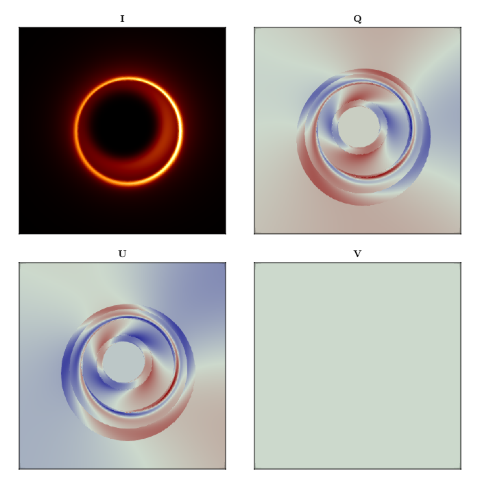

# Creating a Custom Dual Cone Model {#Creating-a-Custom-Dual-Cone-Model}

In this example, we will raytrace the region around a Kerr blackhole as seen by an observer stationed at infinity. We will show the emission coordinates of the n=0 (direct) and n=1 (indirect) photons as they are emitted from the source, at a fixed inclination angle from the blackhole&#39;s spin axis.

First, let&#39;s import Krang and CairoMakie for plotting.

```julia
using Krang
using CairoMakie

curr_theme = Theme(
    Axis = (
        xticksvisible = false,
        xticklabelsvisible = false,
        yticksvisible = false,
        yticklabelsvisible = false,
        ),
)
set_theme!(merge!(curr_theme, theme_latexfonts()))
```


We will use a 0.99 spin Kerr blackhole viewed by an assymptotic observer at an inclination angle of θo=π/4. A region spanned by radii between the horizon and 20M at varying inclinations will be raytraced onto the 20Mx20M screen of the observer.

```julia
metric = Krang.Kerr(-0.94);
θo = 17 * π / 180;
sze = 400;
rmin = Krang.horizon(metric)
rmax = 10.0;
ρmax = 10.0;
χ = -1.705612782769303
ι = 0.5807355065517938
βv = 0.8776461626924748
σ = 0.7335172899224874
η1 = 2.6444786738735804

function profile(r)
    R = 3.3266154761905455
    p1 = 4.05269835622511
    p2 = 4.411852974336667
    return (r/R)^p1/(1+(r/R)^(p1+p2))
end
```


```
profile (generic function with 1 method)
```


Create the material

```julia
camera = Krang.IntensityCamera(metric, θo, -ρmax, ρmax, -ρmax, ρmax, sze);
η2 = π-η1
magfield1 = Krang.SVector(sin(ι)*cos(η1), sin(ι)*sin(η1), cos(ι));
magfield2 = Krang.SVector(sin(ι)*cos(η2), sin(ι)*sin(η2), cos(ι));
vel = Krang.SVector(βv, (π/2), χ);
material = Krang.ElectronSynchrotronPowerLawPolarization();

θs = (75 * π / 180)
geometry1 = Krang.ConeGeometry((θs), (magfield1, vel, (0,1,2), profile, σ))
mesh1 = Krang.Mesh(geometry1, material)
geometry2 = Krang.ConeGeometry((π-θs), (magfield2, vel, (0,1,2), profile, σ))
mesh2 = Krang.Mesh(geometry2, material)

scene = Krang.Scene((mesh1, mesh2))

stokesvals = render(camera, scene)

fig = Figure(resolution=(700, 700));
ax1 = Axis(fig[1, 1], aspect=1, title="I")
ax2 = Axis(fig[1, 2], aspect=1, title="Q")
ax3 = Axis(fig[2, 1], aspect=1, title="U")
ax4 = Axis(fig[2, 2], aspect=1, title="V")
colormaps = [:afmhot, :redsblues, :redsblues, :redsblues]

zip([ax1, ax2, ax3, ax4], [getproperty.(stokesvals,:I), getproperty.(stokesvals,:Q), getproperty.(stokesvals,:U), getproperty.(stokesvals,:V)], colormaps) .|> x->heatmap!(x[1], x[2], colormap=x[3])
fig

save("polarization_example.png", fig)
```


```
┌ Warning: Found `resolution` in the theme when creating a `Scene`. The `resolution` keyword for `Scene`s and `Figure`s has been deprecated. Use `Figure(; size = ...` or `Scene(; size = ...)` instead, which better reflects that this is a unitless size and not a pixel resolution. The key could also come from `set_theme!` calls or related theming functions.
└ @ Makie ~/.julia/packages/Makie/aG6xp/src/scenes.jl:227
```





---


_This page was generated using [Literate.jl](https://github.com/fredrikekre/Literate.jl)._
