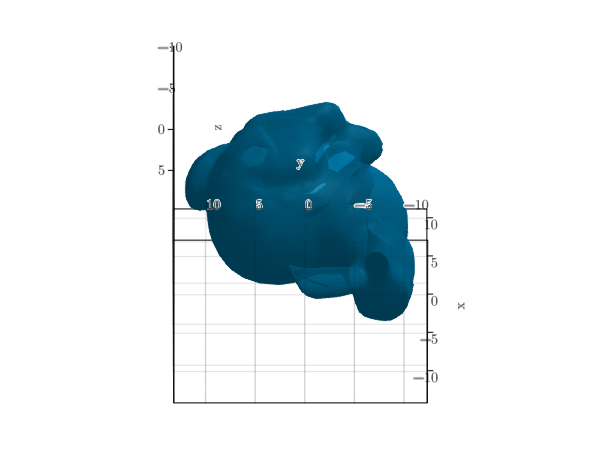
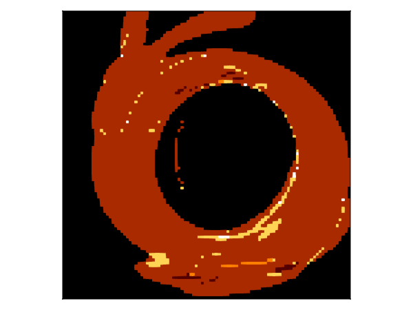

# Raytracing a polygon mesh {#Raytracing-a-polygon-mesh}

```julia
using Krang
import CairoMakie as CMk
using GeometryBasics
using FileIO

spin = 0.99
metric = Krang.Kerr(spin)
θo = 40/180*π
ρmax = 20.0
sze = 200
```


```
200
```


Import external mesh

```julia
bunny_mesh = translate(
    rotate(
        scale(
            load(download("https://graphics.stanford.edu/~mdfisher/Data/Meshes/bunny.obj", "bunny.obj")), 150
            ), π / 2, 0.0, 0.0, 1.0
        ), 15, 3, 0
    )

fig = CMk.Figure()
ax = CMk.Axis3(fig[1,1], aspect=(1,1,1), elevation = 130/180*π, azimuth = 0.0, zreversed=true, xreversed=false)
CMk.mesh!(ax, bunny_mesh, color=[parse(CMk.Colorant, "rgba(0%, 50%, 70%,1.0)") for tri in bunny_mesh.position], colormap = :blues, transparency=true, shading=true)
fig
save("stanford_bunny.png", fig)
```


```
┌ Warning: `shading = true` is not valid. Use `Makie.automatic`, `NoShading`, `FastShading` or `MultiLightShading`. Defaulting to `MakieCore.Automatic()`.
└ @ Makie ~/.julia/packages/Makie/aG6xp/src/lighting.jl:243
```





Raytrace the mesh embedded in the Kerr space time with additive blending

```julia
camera = Krang.IntensityCamera(metric, θo, -ρmax, ρmax, -ρmax, ρmax, sze)

intersections = raytrace(camera, bunny_mesh)
fig = CMk.Figure()
ax = CMk.Axis(fig[1,1], aspect=1, xreversed=true, yreversed=true)
CMk.heatmap!(ax, intersections)
fig

save("mesh_geometry_example.png", fig)
```





---


_This page was generated using [Literate.jl](https://github.com/fredrikekre/Literate.jl)._
