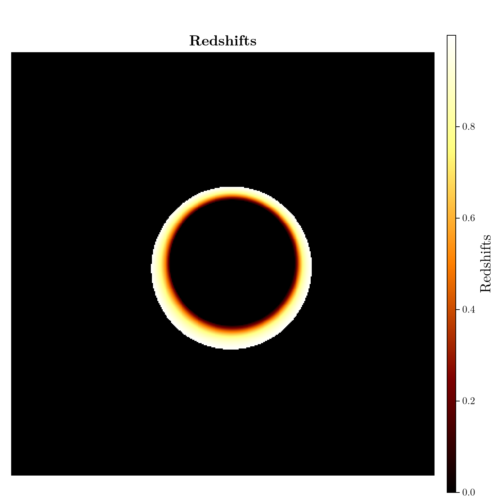

# Defining a Custom Material and Saving Output {#Defining-a-Custom-Material-and-Saving-Output}

We will define a redshift material for raytracing, and export the ray traced quantities to a .npy file.

```julia
using Krang
```


Materials should be functors (i.e. types with callable objects). Our material will ray trace the redshifts associated with a zero angular momentum observer (ZAMO) on a cone for a given sub-image. If the cone is self obscuring, then only the redshift on the side that is closest to the observer will be ray traced.

## Defining the material {#Defining-the-material}

All materials must be subtypes of `AbstractMaterial`.

```julia
struct ZAMORedshifts{T} <: Krang.AbstractMaterial
    subimgs::Tuple{Int}
    rmin::T
    rmax::T
end
```


Define the function for the material. This functor will take in a pixel and a geometry and return the redshift associated with a given sub image. You must include the relevant physics in the functor definition. Here we will include redshift effects associated with a zero angular momentum observer (ZAMO).

```julia
function (m::ZAMORedshifts)(
    pix::Krang.AbstractPixel{T},
    intersection::Krang.Intersection,
) where {T}
    (; rs, θs, νr, νθ) = intersection
    α, β = Krang.screen_coordinate(pix)

    ηtemp = η(metric, α, β, θo)
    λtemp = λ(metric, α, θo)
    curr_p_bl_d = p_bl_d(metric, rs, θs, ηtemp, λtemp, νr, νθ)

    curr_p_bl_u = metric_uu(metric, rs, θs) * curr_p_bl_d
    p_zamo_u = jac_zamo_u_bl_d(metric, rs, θs) * curr_p_bl_u
    redshift = inv(p_zamo_u[1])

    return max(redshift, eps(T))
end
```


## Ray tracing the material {#Ray-tracing-the-material}

We will use a $0.94$ spin Kerr black hole viewed by an asymptotic observer at an inclination angle of $θo=17^\circ$. The emission to be ray traced is

```julia
metric = Krang.Kerr(0.99);
θo = 17 * π / 180;
ρmax = 15.0;
rmin = Krang.horizon(metric); # minimum radius to truncate cone
rmax = 10.0; # maximum radius to truncate cone
n = 1; # sub-image to ray trace
```


Let&#39;s create a camera with a resolution of 400x400 pixels and our mesh.

```julia
camera = Krang.IntensityCamera(metric, θo, -ρmax, ρmax, -ρmax, ρmax, 400);
mesh = Krang.Mesh(Krang.ConeGeometry((75 * π / 180)), ZAMORedshifts((n,), rmin, rmax))
scene = Krang.Scene((mesh,))
```


```ansi
(Krang.Mesh{Krang.ConeGeometry{Float64, Nothing}, Main.var"Main".ZAMORedshifts{Float64}}(Krang.ConeGeometry{Float64, Nothing}(1.3089969389957472, nothing), Main.var"Main".ZAMORedshifts{Float64}((1,), 1.141067359796659, 10.0)),)
```


Finally, we will render the scene with the camera and plot the redshifts.

```julia
redshifts = render(camera, scene)
```


```ansi
400×400 Matrix{Float64}:
 0.0  0.0  0.0  0.0  0.0  0.0  0.0  0.0  …  0.0  0.0  0.0  0.0  0.0  0.0  0.0
 0.0  0.0  0.0  0.0  0.0  0.0  0.0  0.0     0.0  0.0  0.0  0.0  0.0  0.0  0.0
 0.0  0.0  0.0  0.0  0.0  0.0  0.0  0.0     0.0  0.0  0.0  0.0  0.0  0.0  0.0
 0.0  0.0  0.0  0.0  0.0  0.0  0.0  0.0     0.0  0.0  0.0  0.0  0.0  0.0  0.0
 0.0  0.0  0.0  0.0  0.0  0.0  0.0  0.0     0.0  0.0  0.0  0.0  0.0  0.0  0.0
 0.0  0.0  0.0  0.0  0.0  0.0  0.0  0.0  …  0.0  0.0  0.0  0.0  0.0  0.0  0.0
 0.0  0.0  0.0  0.0  0.0  0.0  0.0  0.0     0.0  0.0  0.0  0.0  0.0  0.0  0.0
 0.0  0.0  0.0  0.0  0.0  0.0  0.0  0.0     0.0  0.0  0.0  0.0  0.0  0.0  0.0
 0.0  0.0  0.0  0.0  0.0  0.0  0.0  0.0     0.0  0.0  0.0  0.0  0.0  0.0  0.0
 0.0  0.0  0.0  0.0  0.0  0.0  0.0  0.0     0.0  0.0  0.0  0.0  0.0  0.0  0.0
 ⋮                        ⋮              ⋱            ⋮                   
 0.0  0.0  0.0  0.0  0.0  0.0  0.0  0.0     0.0  0.0  0.0  0.0  0.0  0.0  0.0
 0.0  0.0  0.0  0.0  0.0  0.0  0.0  0.0     0.0  0.0  0.0  0.0  0.0  0.0  0.0
 0.0  0.0  0.0  0.0  0.0  0.0  0.0  0.0     0.0  0.0  0.0  0.0  0.0  0.0  0.0
 0.0  0.0  0.0  0.0  0.0  0.0  0.0  0.0     0.0  0.0  0.0  0.0  0.0  0.0  0.0
 0.0  0.0  0.0  0.0  0.0  0.0  0.0  0.0  …  0.0  0.0  0.0  0.0  0.0  0.0  0.0
 0.0  0.0  0.0  0.0  0.0  0.0  0.0  0.0     0.0  0.0  0.0  0.0  0.0  0.0  0.0
 0.0  0.0  0.0  0.0  0.0  0.0  0.0  0.0     0.0  0.0  0.0  0.0  0.0  0.0  0.0
 0.0  0.0  0.0  0.0  0.0  0.0  0.0  0.0     0.0  0.0  0.0  0.0  0.0  0.0  0.0
 0.0  0.0  0.0  0.0  0.0  0.0  0.0  0.0     0.0  0.0  0.0  0.0  0.0  0.0  0.0
```


## Plotting the redshifts {#Plotting-the-redshifts}

```julia
import CairoMakie as CMk

theme = CMk.Theme(
    Axis = (
        xticksvisible = false,
        xticklabelsvisible = false,
        yticksvisible = false,
        yticklabelsvisible = false,
    ),
)

CMk.set_theme!(CMk.merge!(theme, CMk.theme_latexfonts()))

fig = CMk.Figure(resolution = (700, 700));
ax = CMk.Axis(fig[1, 1], title = "Redshifts", titlesize = 20, aspect = 1)
hm = CMk.heatmap!(ax, redshifts, colormap = :afmhot)
CMk.Colorbar(fig[1, 2], hm, label = "Redshifts", labelsize = 20)
CMk.save("redshifts.png", fig)
```


```ansi
┌ Warning: Found `resolution` in the theme when creating a `Scene`. The `resolution` keyword for `Scene`s and `Figure`s has been deprecated. Use `Figure(; size = ...` or `Scene(; size = ...)` instead, which better reflects that this is a unitless size and not a pixel resolution. The key could also come from `set_theme!` calls or related theming functions.
└ @ Makie ~/.julia/packages/Makie/FUAHr/src/scenes.jl:238
```





Saving the redshifts to a .npy file

```julia
using NPZ
npzwrite("redshifts_n1.npy", redshifts)
```


---


_This page was generated using [Literate.jl](https://github.com/fredrikekre/Literate.jl)._
